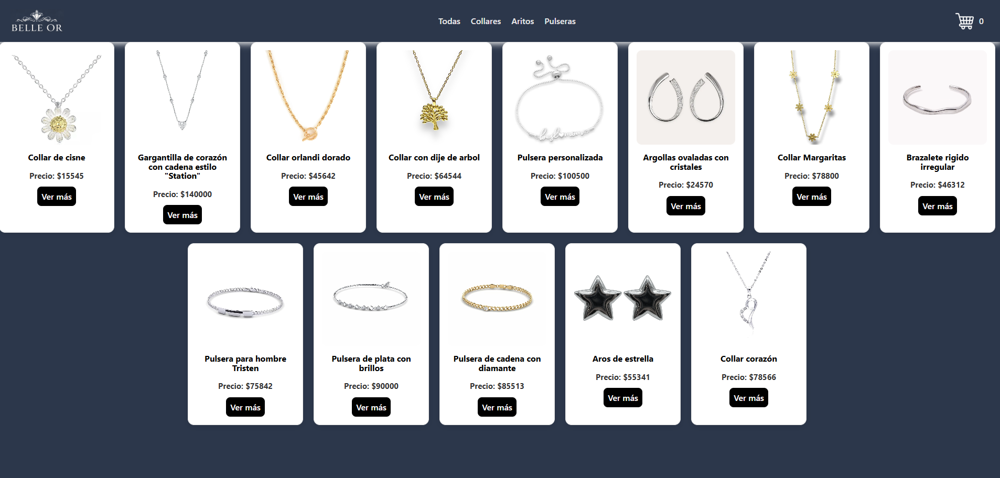
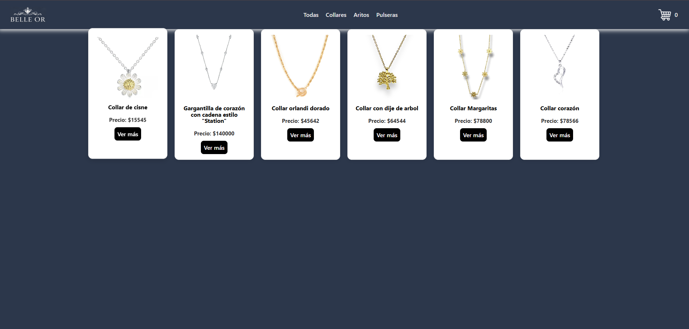
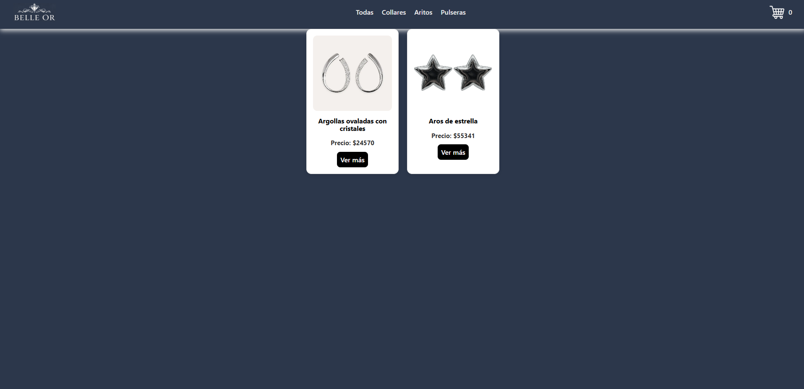
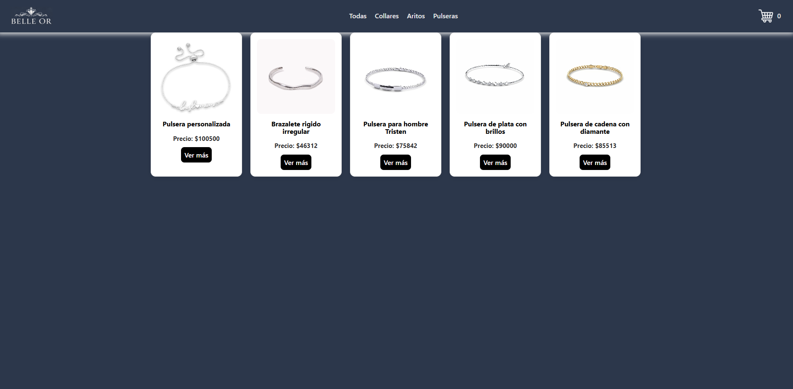
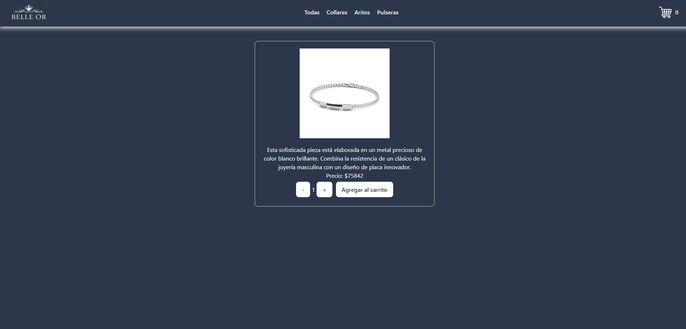
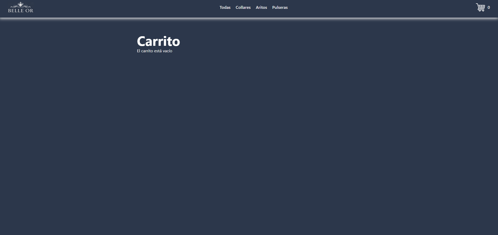
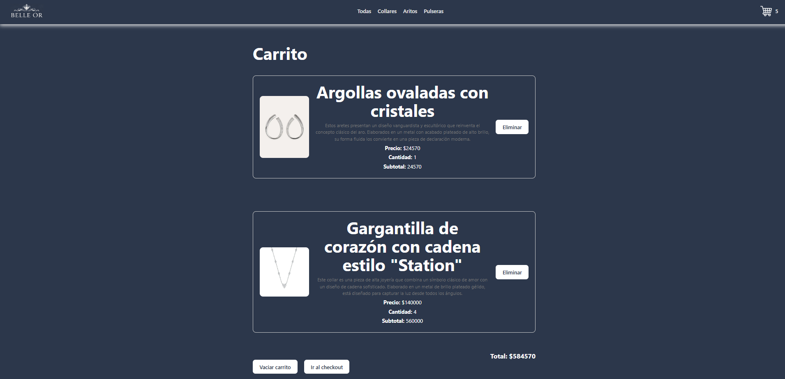
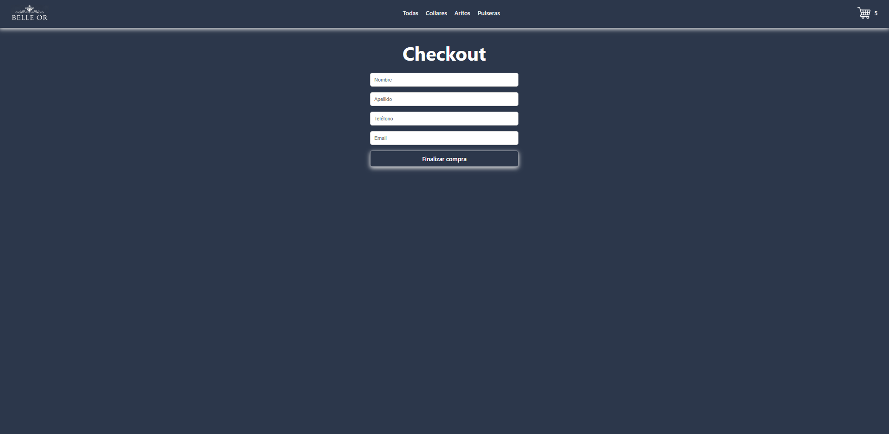
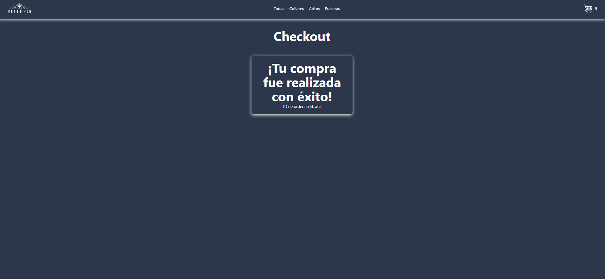

# Belle Or

E-commerce desarrollado con **React + Vite**, que permite visualizar productos, filtrarlos por categoría y navegar entre distintas vistas de la aplicación.

---

## Tecnologías utilizadas

- React  
- Vite  
- Firebase  
- React Router DOM  
- React Hot Toast  
- ESLint  

---

## Instalación

1. Clonar el repositorio:

git clone https://github.com/tu-usuario/belleor.git

2. Ingresar al directorio:

cd belleor

3. Instalar dependencias:

npm install

---

## Scripts disponibles

npm run dev      # entorno de desarrollo  
npm run build    # build de producción  
npm run preview  # previsualizar build  
npm run lint     # ejecutar linter  

---

## Estructura del proyecto

src/
│
├── components/
│   ├── Item/
│   ├── ItemList/
│   ├── ItemListContainer/
│   ├── ItemDetailContainer/
│   ├── NavBar/
│   ├── NavBarContainer/
│   ├── Cart/
│   ├── CartContainer/
│   ├── Checkout/
│   ├── ItemCount/
│   ├── ItemDetail/
│
├── assets/
├── context/
├── firebase/
├── App.jsx
├── AppRouter.jsx
├── main.jsx

---

## Firebase

El proyecto utiliza Firebase para la gestión de datos (productos y categorías).

---

## Funcionalidades

- Listado de productos  
- Filtrado por categorías  
- Navegación dinámica con React Router  
- Notificaciones con React Hot Toast  
- Renderizado dinámico de componentes
- Agregar y eliminar productos de un carrito
- Vaciar el carrito
- Finalizar una compra  

---

## Dependencias principales

{
  "firebase": "^12.11.0",
  "react": "^19.2.0",
  "react-dom": "^19.2.0",
  "react-hot-toast": "^2.6.0",
  "react-router-dom": "^7.13.1"
}

---

## Notas

Proyecto realizado como práctica de desarrollo frontend con React, aplicando conceptos como componentes, hooks y manejo de rutas.

---

## Deploy

El proyecto se encuentra desplegado en Vercel:

https://tu-app.vercel.app

### Pasos para desplegar en Vercel

1. Crear una cuenta en https://vercel.com  
2. Conectar tu repositorio de GitHub  
3. Seleccionar el proyecto  
4. Configurar las variables de entorno (Firebase si corresponde)  
5. Hacer click en "Deploy"  

Vercel detecta automáticamente proyectos con Vite, por lo que no requiere configuración adicional.

---

## Capturas del proyecto

### Home
Vista principal donde se muestran todos los productos disponibles.

### Categorías
Filtrado de productos según la categoría seleccionada.

### Detalle de producto
Vista individual con información detallada del producto.

### Navegación
Barra de navegación que permite moverse entre las distintas secciones de la aplicación.

### Carrito
Muestra de los productos elegidos para realizar la compra. Se pueden eliminar productos, vaciar el carrito o ir al checkout.

### Checkout
Formulario para finalizar la compra.

### Finalización de la compra
Cartel de confirmación de compra exitosa.

---

## Autor

Carolina Muñoz